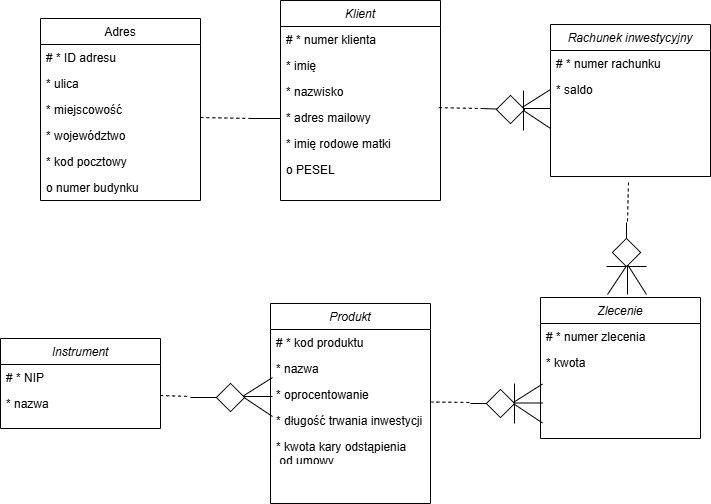

## Modelowany fragment aplikacji bankowej
W uproszczonym modelu fragmentu aplikacji bankowej przyjęto zamodelowanie kontekstu inwestycji. Odpowiada on za składanie i obslugę zleceń oraz relacji między klientami a produktami inwestycyjnymi dostępnymi w banku. Takowy kontekst mogłby zostać zintegrowany z innymi, np. zarządzanie klientem i uwierzytelnianie.

## Diagram w idei Domain Driven Design
W diagramie na Rys. 1.  przedstawiono encje wraz z atrybutami oraz uproszczone związki między nimi (w notacji Barkera).

Rys. 1. Diagram związków encji dla wydzielonego kontekstu aplikacji bankowej

## Założenia przyjmowanych wartości
| Nazwa encji           | Nazwa atrybutu                 | Dopuszczalny format danych | Długość danych [min–max lub wartość] | Integracja z innymi elementami | Komentarz |
|------------------------|--------------------------------|-----------------------------|----------------------------|----------------------------------|-----------|
| Adres                 | ID adresu                      | string, cyfry | 5 | łączony z istniejącym klientem |  |
| Adres                 | ulica                          | string, alfanumeryczne | 3-30 |  |  |
| Adres                 | miejscowość                    | string, alfanumeryczne | 3-30 |  |  |
| Adres                 | województwo                    | string, alfanumeryczne | 3-30 |  |  |
| Adres                 | kod pocztowy                   | string, regex | 5 |  | ^\[0-9]{2}-[0-9]{3}$ |
| Adres                 | numer budynku                  | string, alfanumeryczne | 1-4 |  |  |
| Klient                | numer klienta                  | string, cyfry | 5 | skojarzony z rachunkiem inwestycyjnym |  |
| Klient                | imię                           | string, litery | 3-20 |  |  |
| Klient                | nazwisko                       | string, litery, dopuszczalny myślnik | 3-40 |  | myślnik potrzebny przy nazwiskach dwuczłonowych |
| Klient                | adres mailowy                  | string, regex | wedle regex, max 40 znaków |  | ^\[A-Za-z0-9._%+-]+@[A-Za-z0-9.-]+\.[A-Za-z]{2,}$|
| Klient                | nazwisko rodowe matki              | string, litery | 3-40 |  | poprawka z błędu na diagramie |
| Klient                | PESEL                          | string, regex | 11 |  | ^\[0-9]{11}$ |
| Rachunek inwestycyjny | numer rachunku                 | string, alfanumeryczne | 16 |  | na niego składane jest zlecenie |
| Rachunek inwestycyjny | saldo                          | float, dwa miejsca dziesiętne dokładności | 0-999 999 999 999.99 |  | zaokrąglane w dół |
| Instrument            | NIP                            | string, regex | wedle regex |  | ^\d{3}-\d{3}-\d{2}-\d{2}$, format z myślnikami |
| Instrument            | nazwa                          | string, alfanumeryczne | 2-40 |  |  |
| Produkt               | kod produktu                   | string, alfanumeryczne | 5 | możliwy do zakupu przez złożenie zlecenia |  |
| Produkt               | nazwa                          | string, alfanumeryczne | 2-30 |  |  |
| Produkt               | oprocentowanie                 | float, dwa miejsca dziesiętne dokładności | 0.00-99.99 | w połączeniu z oprocentowaniem oraz kwotą zlecenia może realizować prognozę zarobku na inwestycji |  |
| Produkt               | długość trwania inwestycji     | int | 1-120 |  | ilość miesięcy |
| Produkt               | kwota kary odstąpienia od umowy| float | 0.00-200.00 |  | procent od zakupionej ilości produktu |
| Zlecenie              | numer zlecenia                 | string, alfanumeryczne | 10 |  |  |
| Zlecenie              | kwota                          | float, dwa miejsca dziesiętne dokładności | 0.00-999 999.99 |  |  |
