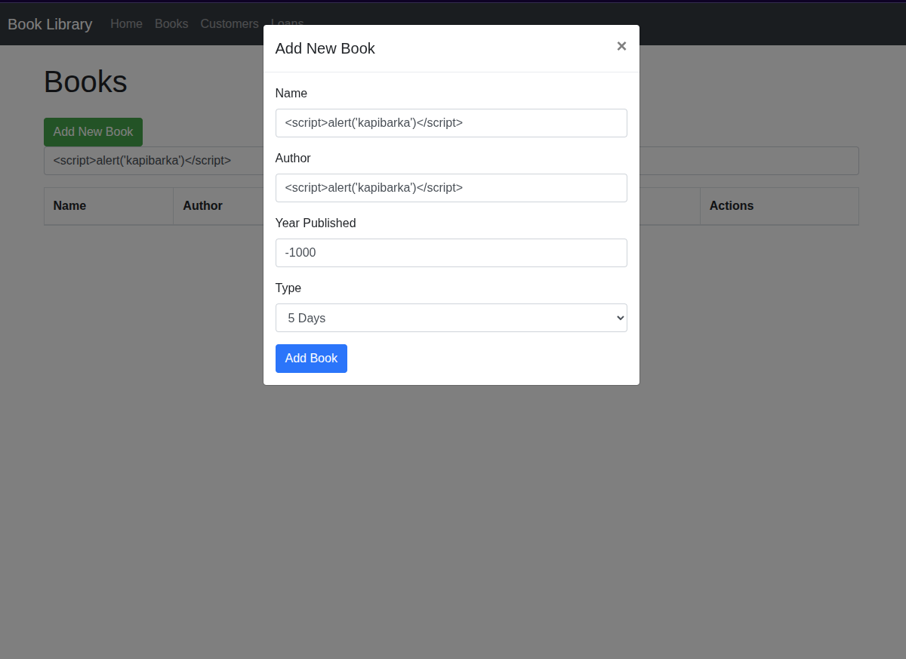
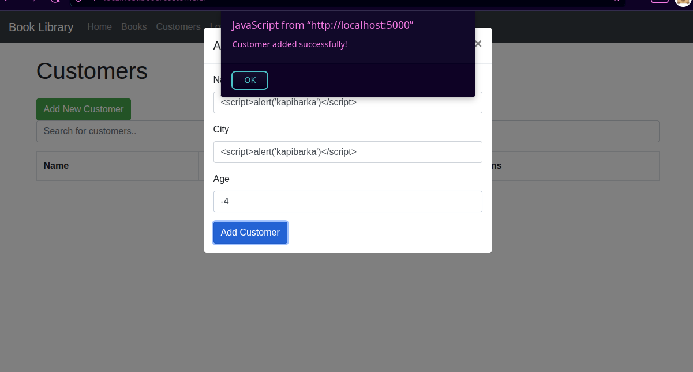
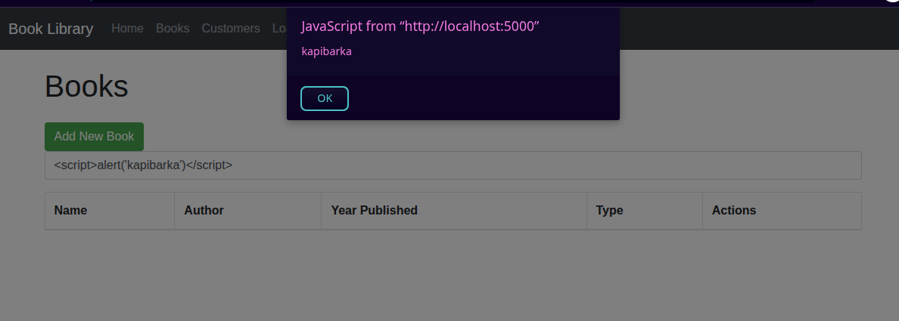
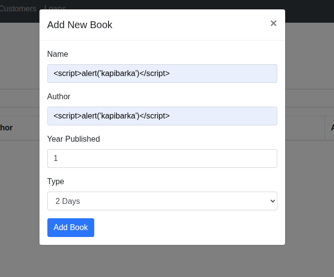
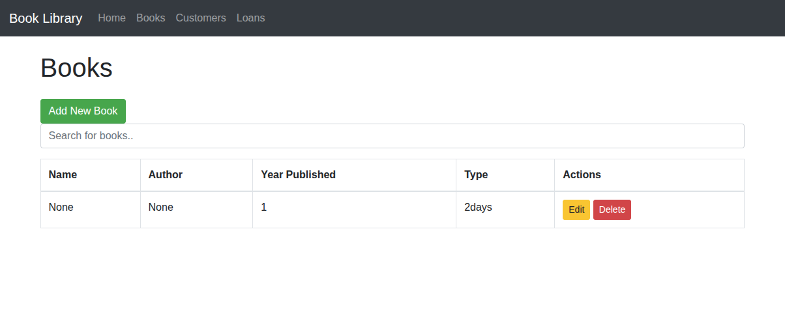

## Wstrzyknięcia XSS - wykrycie podatności
Weryfikowano występowanie podatności XSS w aplikajci symulującej bibliotekę. W tym celu użyto przykładowego kodu JavaScript w postaci
```
<script>alert('kapibarka')</script>
```
Dzięki zastosowaniu kodu możliwe było wykrycie podatności poprzez wklejanie do pól oczekujących wartości od użytkownika. Testy wykonano poprzez użycie interfejsu użytkownika aplikacji w zakładkach umożliwiających dodawanie nowego/nowych: książek (Books), klientów (Customers), wypożyczeń (Loans). Wynikiem działań było zarejestrowanie licznych alertów skojarzonych z polami formularza opisanymi w Tab. 1. Ponadto zarejestrowano problem w możliwości dodawania dat UJEMNYCH, co jest jednak błędem designu nie generującym w otrzymanym fragmencie aplikacji podatności. Na Zdj. 1-3. zamieszczono wynik wstrzyknięć XSS, który analogicznie występował dla pól opisanych w Tab. 1.

#### Tab. 1. Wykryte miejsca występowania podatności w formularzach
| Nazwa formularza | Pole |
|------------------------|------------------------|
| Books | Name |
| Books | Author |
| Customer | Name |
| Customer | City |


Zdj. 1.

Zdj. 2.

Zdj. 3.

Skrypt wykonywał się przy każdym wyświetleniu listy. 

## Poprawki
W celu wprowadzenia poprawek wprowadzono następujące zmiany do plików źródłowych backendu:
- Ograniczenie dolne i górne lcizby znaków w formsach zgodnie z modelami w bazie danych
- Listę znaków dozwolonych (regex) dla odpowiednich pól
- Czyszczenie danych przed zapisem do bazy danych (lub ich edycją) z tagów HTML (z użyciem biblioteki bleach)

Edytowane pliki: forms.py, models.py, vievs.py dla Customer, Books, Loans.

Wynik działania dla przykładu z dodawania/edycji książki jest widoczny na Zdj. 4-5. Teraz wstrzyknięcie powoduje dodanie z wartościami None. Udowadnia to brak możliwości wstrzyknięć XSS. Analogiczne czynności wykonano to dla pozostałych formularzy.


Zdj. 4.

Zdj. 5.

Zarejestrowano dodatkowy problem w braku escape'owania w plikach html przez użycie funkcji safe. Tym sposobem przeglądarka może wykonać złośliwy kod. Aby temu zapobiec należy usunąć tę funkcję co wykonano w plikach z katalogu templates/.